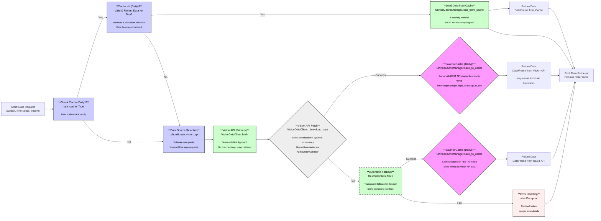

# Market Data Retrieval Workflow

## Updated Workflow Overview

This diagram illustrates the improved market data retrieval workflow with two key optimizations:

1. **Download-First Approach**: The Vision API client now uses a direct download-first approach without pre-checking file existence, significantly improving performance.

2. **Automatic Fallback**: If Vision API fails to retrieve data, the system automatically and transparently falls back to REST API.

The workflow retains the existing advantages while adding these performance and reliability improvements.

## Process Description

The data retrieval process begins with a user request for market data. The system first checks for valid REST API-aligned cached data. If found, it's immediately returned.

Otherwise, the data source selection process is triggered:

- **Primary Path (Vision API with Download-First)**:

  - The system tries Vision API first for most requests, especially larger historical ones
  - Uses download-first approach (no pre-checking) for optimal performance
  - Applies dynamic concurrency optimization based on batch size
  - Downloads data by day, combines results, and caches with REST API-aligned boundaries

- **Automatic Fallback Path (REST API)**:
  - If Vision API fails or returns no data, the system automatically falls back to REST API
  - This fallback is transparent to the user - same interface and data format
  - REST API data is also cached for future retrieval

All data sources (Vision API, REST API, and cache) deliver consistent results with identical time boundaries, ensuring a seamless experience regardless of which source ultimately provides the data.

## Key Benefits

1. **Improved Performance**: The download-first approach eliminates unnecessary HEAD requests
2. **Higher Reliability**: Automatic fallback ensures data retrieval even when Vision API is unavailable
3. **Optimized Resource Usage**: Dynamic concurrency adjustment based on batch size
4. **Consistent Data Format**: All sources return identical data structure
5. **Transparent Experience**: Users don't need to worry about which source provides the data
